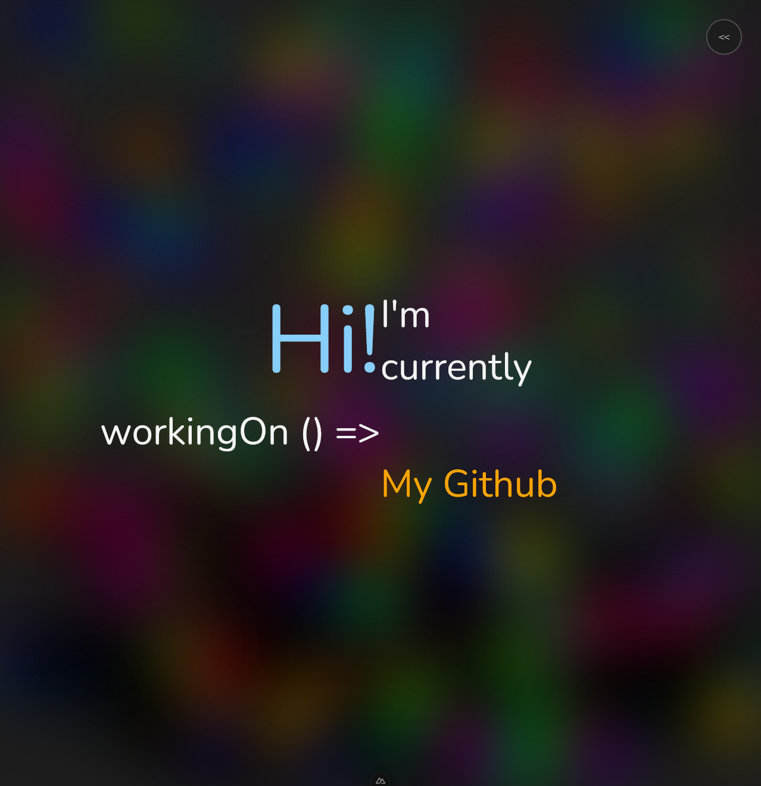

# My little portfolio
Hi, my name is Kristoffer and this repo is a showcase of some of the projects I've worked on since I started my journey as a developer in 2023.

# Project status & updates
Currently I'm working on a new version of this portfolio while I'm looking for other projects.

# Old portfolio versions
I'm including a preview of my old portifolio creations that I've made over the years. Original files are included in the `/versions` folder

## V3 Nuxt3 (2024Q2)
- After having to use vue and nuxt for multiple projects it's come to be one of my favorite front-end frameworks for creating websites.

## V2 NextJS 11 (2023Q3)
- This iteration was done a few weeks later after learning more about react and next. I had started looking into typescript at this point.

 

## V1 Basic html/js (2023Q2)
- This was the first portifolio I created after studying front-end at kodehode, at this time we had only gone trough html, css and javascript.

