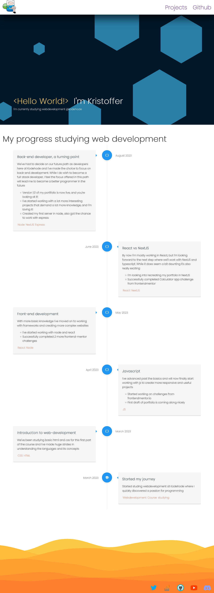
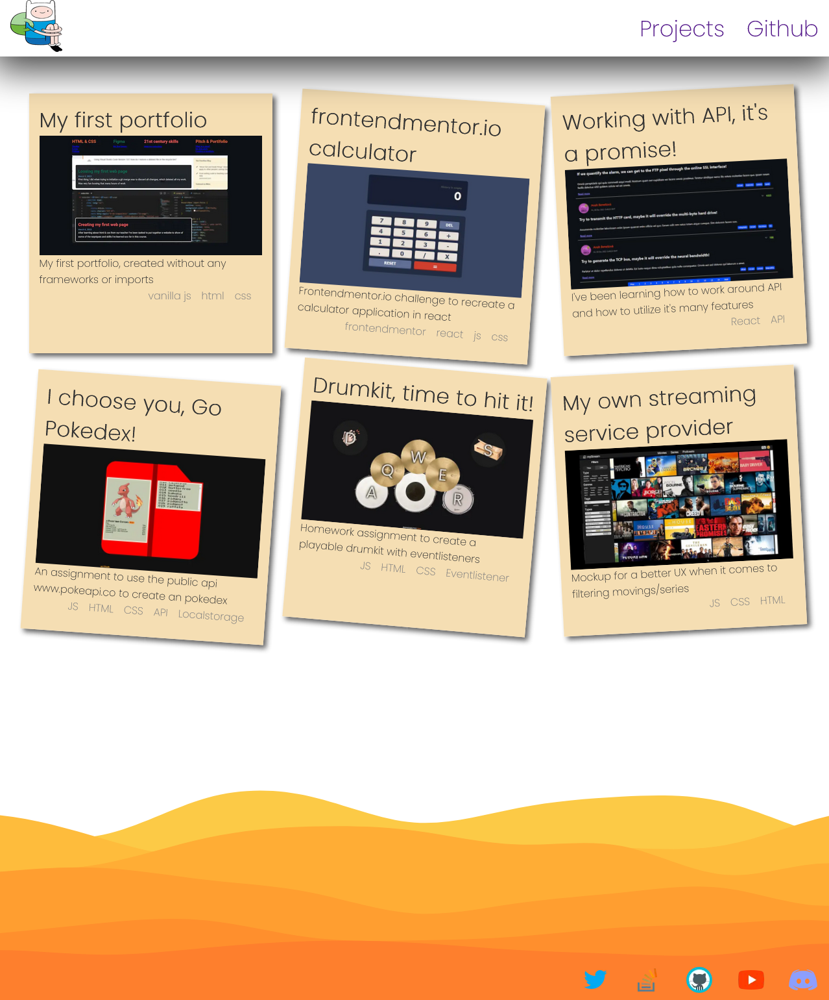
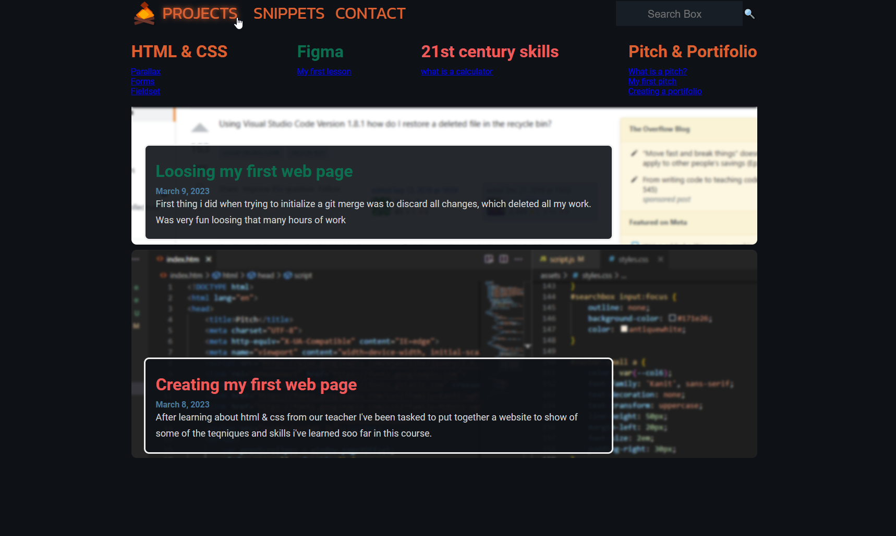

# My little portifolio
Hi, my name is Kristoffer

# Versions
I'm including a preview of my old portifolio creations that I've made over the years.
## v3 Nuxt3 (2024Q2)
After having to use vue and nuxt for multiple projects it's come to be one of my favorite front-end frameworks for creating websites.

## v2 NextJS 11 (2023Q3)
This itteration was done a few weeks later after learning more about react and next. I had started looking into typescript at this point.

## v1 Basic html/js (2023Q2)
This was the first portifolio I created after studying front-end at kodehode, at this time we had only gone trough html, css and javascript.

